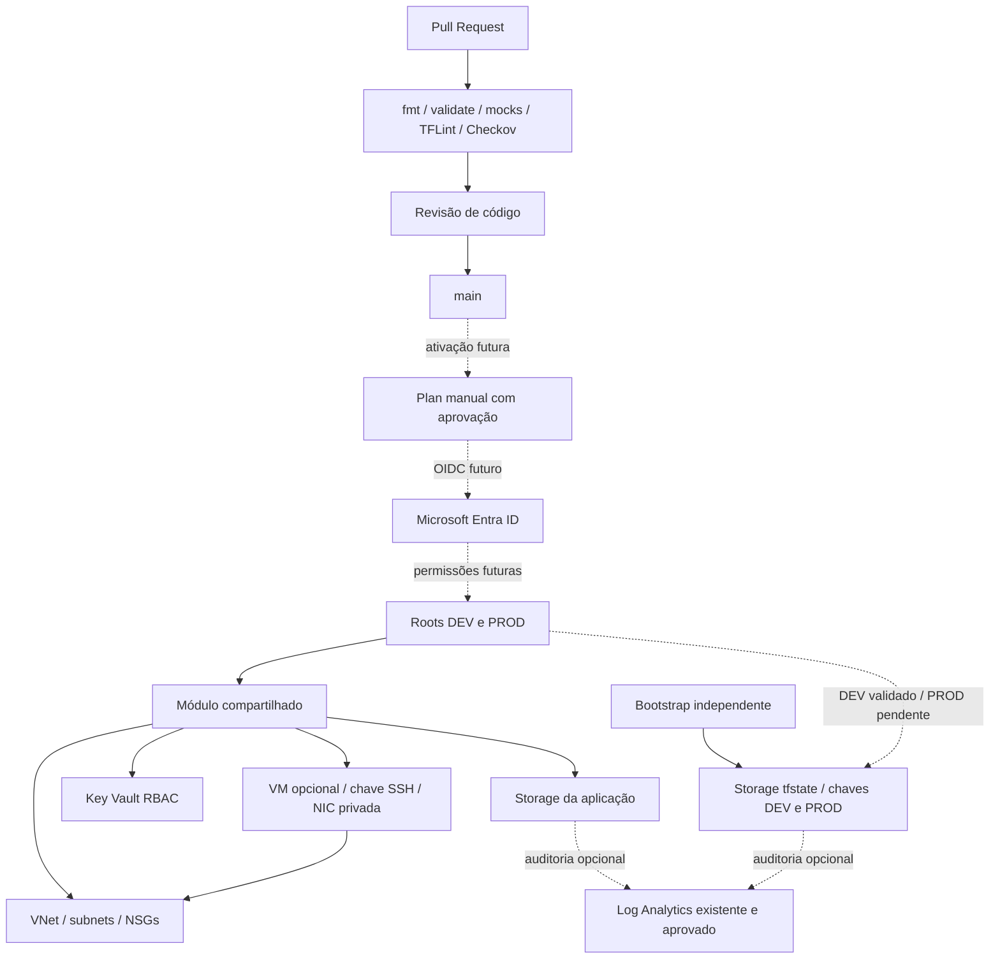

# Arquitetura e fluxo de entrega

O diagrama descreve configuração e dependências. Backend e DEV sem VMs foram
validados em sessão temporária e removidos; veja as
[evidências](azure-validation-2026-09-18.md) e a [visão gráfica no README](../README.md#arquitetura-atual-do-código).
As setas de OIDC representam uma evolução ainda não executada.

Web permite 443 de Internet no NSG, sem endpoint Web público implementado.
App permite 8080/8443 da subnet Web e SSH opcional de hosts privados explícitos.
Data permite portas de banco da subnet App, mas não há banco implementado.
As VMs ficam em App; não há aplicação completa em três camadas. Egress mantém
regras padrão e a instalação de Docker precisa ser validada no deploy aprovado.

Storage e Key Vault usam firewall Deny; nenhum Private Endpoint está criado.
State não reutiliza Storage da aplicação. DEV/PROD possuem configurações e chaves
separadas, mas isolamento real de acesso depende do RBAC futuro.

Veja [ADRs](adr/README.md), [rede](network-security.md), [auditoria](blob-audit.md)
e [ponto de parada Azure](azure-readiness.md). O roteiro de
[apresentação](portfolio-presentation.md) distingue evidência local de operação real.
